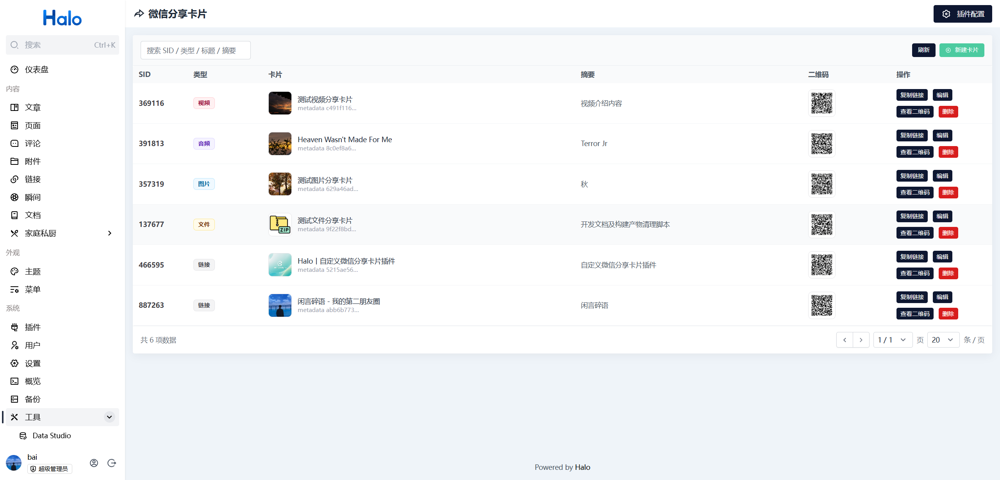
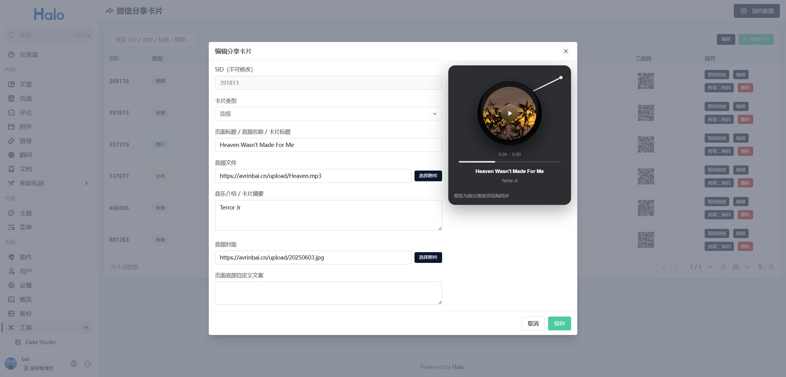
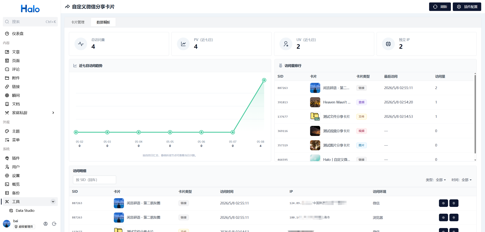
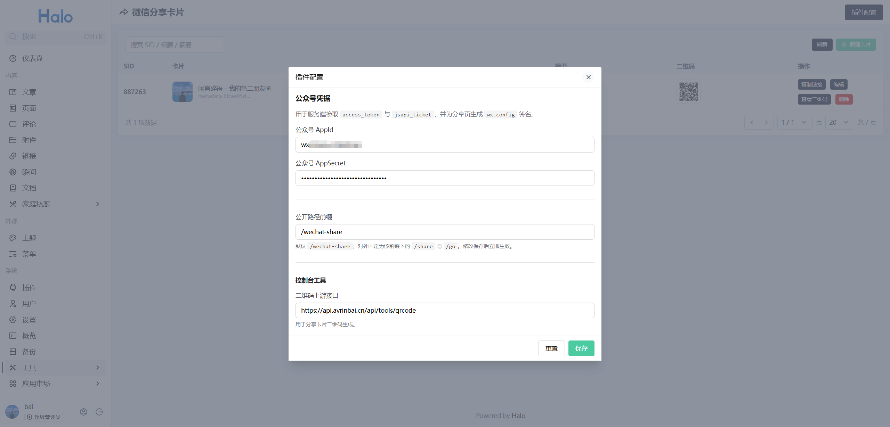
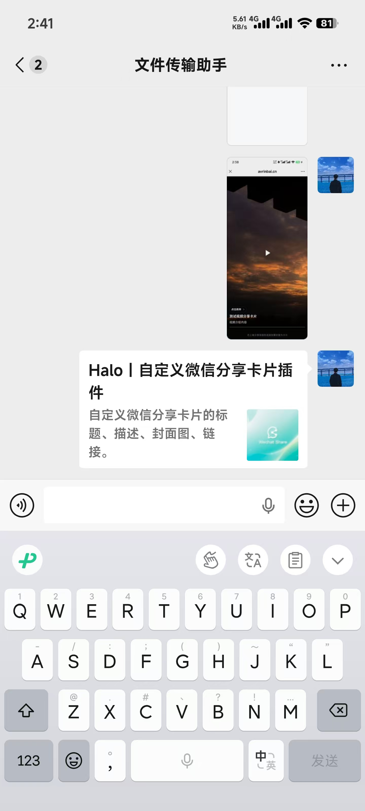
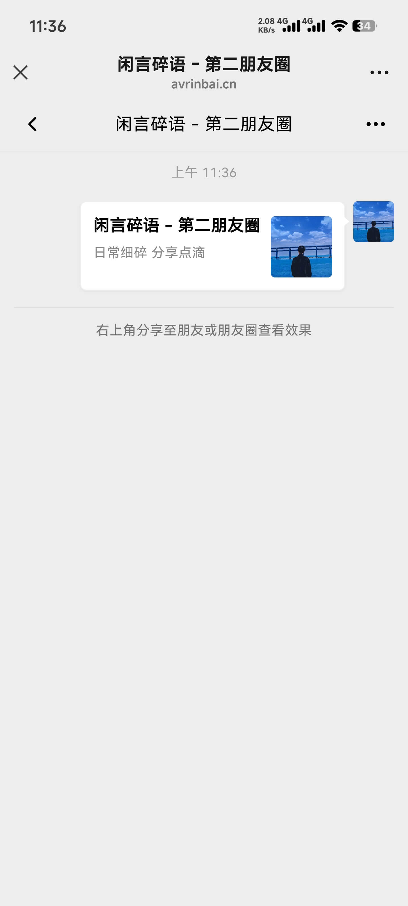
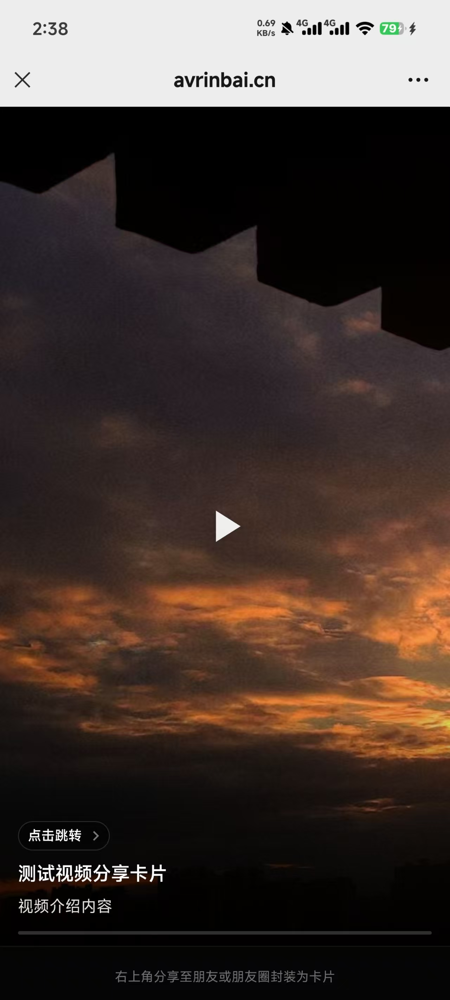
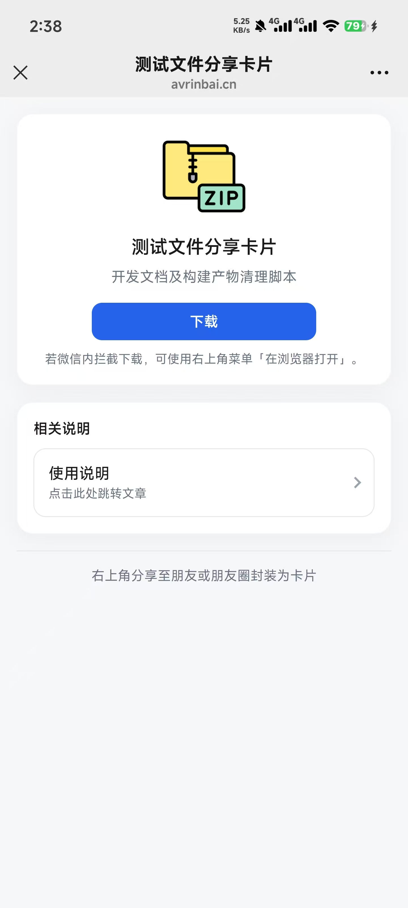
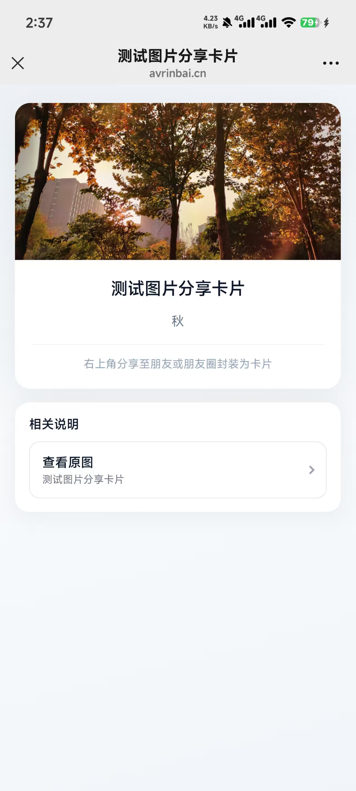

<div align="center">
    
    <h1>Halo - Wechat Share（自定义社交分享卡片）</h1>
    <p>将网址、图片、音乐、视频、文件封装为卡片样式分享至微信或QQ，并提供数据看板功能</p>
    <p align="center">
    <a href="https://www.halo.run/store/apps/app-c6kw29tr"></a>
        <a href="https://github.com/Avrinbai/halo-plugin-wechat-share/releases"></a>
        <a href="https://www.gnu.org/licenses/gpl-3.0.html"></a>
        
    </p>

</div>

## 写在前面

在开始使用本插件之前，请先完成以下必要配置，否则微信分享卡片将无法正常生效：

### 1. 配置公众号信息
在后台填写你的公众号 **AppId** 与 **AppSecret**，用于获取微信 JS-SDK 权限。

### 2. 设置 JS 接口安全域名
前往微信公众号后台，在「开发 → 接口权限」中配置 **JS 接口安全域名**，确保当前网站域名已加入白名单。

> ⚠️ 未配置安全域名时，微信将无法正确获取自定义分享信息。

### 3. 账号类型说明
支持以下账号类型：
- 公众/服务号
- 测试号

### 4. 其他说明

- 若未完成上述配置，直接在微信内使用,等配置完成后，请务必清理微信软件缓存，以确保配置生效。
- QQ分享卡片无需配置公众号信息。
---

## 目录

| 章节 | 说明 |
|------|------|
| [插件功能](#插件功能) | 能力列表 |
| [卡片类型说明](#卡片类型说明) | 链接 / 图片 / 音频 / 视频 / 文件 |
| [数据看板](#数据看板) | 访问统计、趋势、排行、访问明细与实验性 IP 归属 |
| [预览图](#预览图) | 控制台与手机端截图 |
| [快速开始](#快速开始) | 安装、配置、使用 |
| [公开 URL 说明](#公开-url-说明) | 分享页、跳转、路径前缀 |
| [微信域名校验（Nginx 映射）](#微信域名校验nginx-映射) | 通过Nginx临时映射校验文件
| [二次开发及构建说明](#二次开发及构建说明) | 构建、调试 |
| [许可证](#许可证) | 协议 |

## 插件功能

- 多种卡片类型：支持 **卡片 / 图片 / 音频 / 视频 / 文件** 专属页样式（详见下节）
- 分享内容自定义：标题、摘要/介绍、封面图、媒体或跳转地址等；每张卡片独立 **SID**，数据存 Halo 扩展资源
- 控制台列表：复制分享链接、编辑、删除；支持 **二维码预览**（不依赖外部访问地址与二维码生成接口）
- 数据看板：汇总访问指标、近七日趋势、访问量排行、访问明细筛选与详情（详见 [数据看板](#数据看板)）
- 插件设置：公众号 **AppId / AppSecret**（服务端换票与 `wx.config` 签名）、**公开路径前缀**（默认 `/wechat-share`）、可选 **实验性 IP 归属查询** 及上游接口地址
- 分享落地页在微信内置浏览器中加载 **jweixin**，调用 `updateAppMessageShareData` / `updateTimelineShareData` 更新会话与朋友圈分享卡片
- 在手机 QQ 内置浏览器中通过 **`mqq.invoke('data','setShareInfo')`** 与 Open Graph 式 **meta** 标签定制分享卡片（无需额外 AppId）

## 卡片类型说明

新建卡片时可在控制台选择 **卡片类型**。类型决定访客打开的落地页版式，以及微信内二次分享时的链接策略（与插件内逻辑一致）：

| 类型 | 说明 | 落地页要点 |
|------|------|------------|
| **链接** | 适合普通外链分享 | 分享卡片点开会 **302 跳转到** 你填写的跳转 URL（`/go/{sid}`） |
| **图片** | 以图为主、可配文案 | 扫码进入 `/share`（带引导）；微信/QQ 二次分享使用 `/view` |
| **音频** | 音乐/播客等 | 同上 |
| **视频** | 竖屏沉浸预览 | 同上 |
| **文件** | 附件下载 | 同上 |

**填写提示（共性）：**

- 封面、媒体、跳转等地址需为 **`http` / `https`**（或控制台内通过附件解析为可访问的绝对地址）。
- **链接卡片** 的标题、摘要长度限制仍为 **32 字**（与历史行为一致）；其他类型的介绍等字段可更长，以控制台校验为准。

**在微信里怎么用：** 仍建议用控制台生成的 **二维码** 在微信内打开落地页，再按页面提示从右上角发起分享（与上版本一致）。

## 数据看板

### 概览指标

- **卡片总数 / 启用数**：当前插件内卡片数量及启用状态统计  
- **累计访问（总 PV）**：来自统计扩展的站内汇总  
- **PV（近七日）**：与下方趋势图按自然日汇总一致  
- **UV（近七日） / 独立 IP（全站）**：基于访问明细内 IP 的去重统计（无 IP 的记录不计入 UV）  
- **访问环境分布**：微信内置浏览器、企业微信、其他移动浏览器、桌面浏览器等大致占比  

### 图表与排行

- **近七日访问趋势**：按自然日展示最近 7 天的访问量折线（与「PV（近七日）」同源）  
- **访问量排行**：按卡片 **累计访问次数** 排序；列表固定高度、内部滚动，展示 SID、卡片封面与标题、类型、**最后访问时间**、访问量等（条目数量有上限，以实际版本为准）  

### 访问明细

表格列出单次访问记录，支持：

| 能力 | 说明 |
|------|------|
| **按 SID 搜索** | 输入 SID 回车筛选 |
| **卡片类型** | 按链接 / 图片 / 音频 / 视频 / 文件筛选（与记录上的类型字段一致） |
| **时间** | 如今天、近 7 天、近 30 天等预设区间 |
| **查看详情** | 弹窗展示该次访问的动作、时间、环境、IP、User-Agent 等 |
| **分页** | 调整每页条数与页码 |

### 实验性功能：IP 归属地查询

在 **插件配置** → **实验功能** 中可开启 **「访问明细 · IP 归属地查询」**。

- **默认关闭**；开启后，访问明细与详情弹窗中可对一条记录点击 **「查归属」**（实验能力）。  


## 预览图

### 控制台

<div style="display:flex; gap:10px;">



</div>

<div style="display:flex; gap:10px;">



</div>

### 手机端

<div style="display:flex; gap:10px;">




</div>

<div style="display:flex; gap:10px;">




</div>


## 快速开始

### 1) 安装插件

在 Halo 应用市场安装，或在本仓库 [Releases](https://github.com/Avrinbai/halo-plugin-wechat-share/releases) 下载构建产物后 **手动上传** 安装。

### 2) 打开控制台

进入 Halo 控制台：**系统 → 工具 → 自定义社交分享卡片**。

页面内可在 **卡片管理** 与 **数据看板** 之间切换：前者维护卡片，后者查看访问统计与明细。

### 3) 插件配置（右上角「插件配置」）

按需填写下表；分享链接、跳转 URL 中的 **站点根** 取自 Halo **设置 → 外部访问地址**，插件内 **无需** 再填站点域名。

**保存成功后会自动刷新当前页面**，以便列表、数据看板等立即使用最新配置。

| 配置项 | 说明 |
|--------|------|
| 公众号 AppId / AppSecret | 服务端换取 `access_token`、`jsapi_ticket`，并为分享页生成 `wx.config` 签名（正式号或测试号均可） |
| 公开路径前缀 | 默认 `/wechat-share`；保存后与站点根拼接，形成对外访问路径 |
| 实验功能 · IP 归属地查询 | 默认关闭；开启后数据看板访问明细可使用「查归属」，详见 [数据看板](#数据看板) 章节 |
| IP 归属查询接口 | 后端代理调用的 GET 地址（如默认 `.../ip-location?ip=`）；关闭实验功能时不生效 |

> **关于二维码：** 控制台与接口返回的分享二维码由**插件服务端**（ZXing）根据「外部访问地址 + 公开路径 + SID」生成 **PNG**，并缓存在卡片扩展字段中；**不再**使用、也不再在控制台配置「二维码上游 HTTP 接口」。从旧版本升级时，已缓存的二维码仍可照常显示；新建或编辑保存后会重新生成。

**微信公众平台侧（必须）：**

- 在公众号后台配置 **[JS 接口安全域名](https://developers.weixin.qq.com/doc/offiaccount/OA_Web_Apps/JS-SDK.html#62)**（域名不含 `http(s)://` 与路径），须与你在微信内打开的分享页域名一致。
- 使用 **[测试号](https://mp.weixin.qq.com/debug/cgi-bin/sandbox?t=sandbox/login)**：将测试号提供的 AppId / AppSecret 填入本插件；测试号同样需在后台维护「JS 接口安全域名」及相关接口权限，流程与正式号类似。

### 4) 新建卡片

1. 选择 **卡片类型**（链接 / 图片 / 音频 / 视频 / 文件）。
2. 按表单填写对应字段：至少包含分享所需的标题与封面；链接类需跳转 URL；媒体类需媒体地址（音频/视频/文件）及介绍文案等。
3. 保存后可在列表中复制 **分享链接** 或打开 **二维码预览** 用于推广。

各类型字段含义与校验以控制台界面为准；编辑弹窗右侧提供 **实时预览**（版式与访客落地页一致）。

### 5) 在微信或 QQ 中使用

将生成的二维码在 **微信** 或 **手机 QQ** 内扫描打开落地页，再按页面提示从右上角菜单分享给好友/群即可查看自定义卡片效果。

**微信：** 须配置公众号 AppId / AppSecret 与 JS 接口安全域名；实践中更稳妥的方式仍是扫码进入落地页后再分享。

**手机 QQ：** 使用 [setShareInfo](https://open.mobile.qq.com/api/mqq/index#api:setShareInfo) 定制分享；`share_url` 须与落地页 **同域名**，分享图建议 **≥200×200**。

---

## 公开 URL 说明

假定 Halo 外部访问地址为 `https://example.com`，公开路径前缀为 `/wechat-share`（默认）：

| 路径 | 作用 |
|------|------|
| `https://example.com/wechat-share/share/{sid}` | 推广落地页（扫码、复制链接；媒体类含分享引导文案） |
| `https://example.com/wechat-share/share?sid={sid}` | 同上（旧 query 形式，仍支持） |
| `https://example.com/wechat-share/view/{sid}` | 媒体类（图片/音频/视频/文件）二次分享落地页，**无引导文案** |
| `https://example.com/wechat-share/view?sid={sid}` | 同上（旧 query 形式，仍支持） |
| `https://example.com/wechat-share/share/{sid}?hint=0` | 兼容旧版：自动 **302** 跳转至 `/view/{sid}` |
| `https://example.com/wechat-share/go/{sid}` | 302 跳转到卡片配置的落地 URL（链接卡片微信分享用） |
| `https://example.com/wechat-share/go?sid={sid}` | 同上（旧 query 形式，仍支持） |

修改「公开路径前缀」并保存后，对外路径随之变化（别忘了更新已发出的推广链接）。

---

## 微信域名校验（Nginx 映射）

该方式通过 Nginx 临时暴露校验文件，示例：

---

### 1. 修改 Nginx 配置

在站点配置中添加：

```nginx
location /MP_verify_xxxxx.txt {
    root /www/wechat_verify;
}
```

---

### 2. 创建目录并放入文件

```bash
mkdir -p /www/wechat_verify
mv MP_verify_xxxxx.txt /www/wechat_verify/
```

---

### 3. 重载 Nginx

```bash
nginx -s reload
```

---

### 4. 验证

浏览器访问：

```
https://你的域名/MP_verify_xxxxx.txt
```

能够正常打开即配置成功 ✅

---

## 二次开发及构建说明


**[https://avrinbai.cn/archives/QXuapZl4](https://avrinbai.cn/archives/QXuapZl4)**

---


## 许可证

本项目采用 [**GNU General Public License v3.0**](https://www.gnu.org/licenses/gpl-3.0.html)（与 `src/main/resources/plugin.yaml` 声明一致）。
